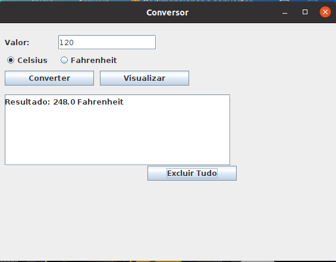

# CRUDJavaSwingBD
Este projeto mostra como implementar um CRUD utilizando Java Swing + Banco de Dados MySQL

<iframe width="560" height="315" src="https://www.youtube.com/embed/51tulDzs8Rk?si=GpWsdEp0mWSBmEqs" title="YouTube video player" frameborder="0" allow="accelerometer; autoplay; clipboard-write; encrypted-media; gyroscope; picture-in-picture; web-share" allowfullscreen></iframe>
